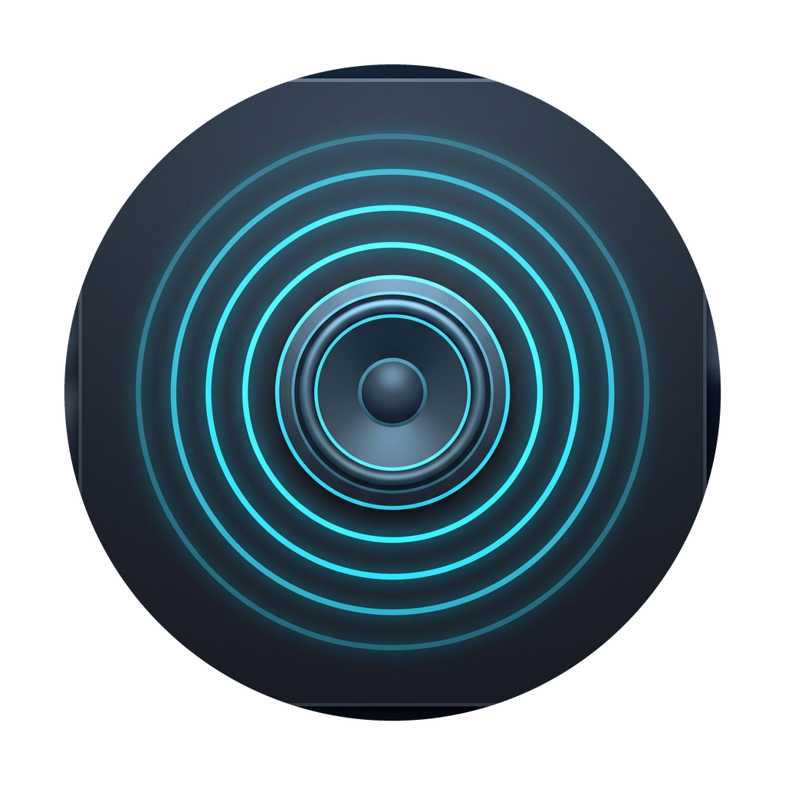

# 🔉 Volly — Native macOS Per-App Volume Mixer & Audio Router

<p align="center">
  
</p>

**Volly** is a native, lightweight, and modern macOS menu-bar utility that gives you the audio mixing controls Apple never built. With Volly, you can adjust the volume of individual applications (like Spotify, Safari, Google Chrome, YouTube, Discord, or Apple Music) independently, route specific apps to different playback devices (like AirPods or speakers) simultaneously, and boost quiet ones up to 200%.

Built entirely in native **Swift** and **SwiftUI**, Volly runs purely in user-space using **Apple's modern CoreAudio Process Taps API** (macOS Sonoma 14.2+). **No kexts, no system extensions, and no virtual loopback audio drivers required.**

---

## ✨ Features

- **🎯 Per-App Volume Sliders:** Command the audio level of every running, sound-producing application individually.
- **🔥 200% Volume Boost:** Amplify quiet media files and application streams past their native system boundaries.
- **⚡ Quick Mute/Unmute:** Instantly toggle sound streams off/on with a single click of a dedicated mute button.
- **✏️ Inline Persistent Renaming:** Rename any app (e.g. rename "Google Chrome Helper" to "YouTube" or "Chrome Music") directly in the mixer interface. Custom names save dynamically to `UserDefaults` and persist across launches.
- **🎛️ Individual Hardware Audio Routing:** Route different apps to different physical outputs (AirPods, USB DACs, Display Speakers, etc.) at the same time. Custom routes are saved and restored automatically.
- **🗑️ Mixer Deletion/Ignore Lists:** Delete or hide apps you don't want to see from your sound list. All deleted items are completely ignored from taps and can be restored at any time.
- **🔄 Dynamic Hot-Plug Listeners:** Real-time listeners automatically update your device lists and rebuild audio aggregate routes whenever you plug in a headphone, connect AirPods, or switch system outputs.
- **🧹 Global Settings & Factory Reset:**
  - **Reset All Sliders:** Reverts all app volumes to 100% and unmutes them instantly.
  - **Restore Hidden Apps:** Instantly unhides and re-binds any applications you previously deleted/ignored.
  - **Reset Everything to Default:** A full factory sweep that purges all custom names, audio routes, ignore lists, and volumes, resetting Volly to pristine initial state.
- **🎨 Glassmorphic Interface:** Matches the modern macOS visual design (HUD styling with system-wide vibrancy and smooth hover-reveal animations).

---

## 🛠️ System Architecture: How It Works

Historically, per-app audio routing on macOS required complex virtual sound drivers (like Soundflower or BlackHole). Volly utilizes modern, high-performance CoreAudio interfaces running entirely in user-space:

```
  [Target App (e.g. YouTube inside Safari)]
                       │
                       ▼  (Audio stream intercepts here)
               ┌───────────────┐
               │  CoreAudio    │  ◄── CATapDescription (muteBehavior = .muted)
               │  Process Tap  │      (Prevents the raw, unscaled sound from playing)
               └───────┬───────┘
                       │  [Input PCM Audio Frames (Float32)]
                       ▼
               ┌───────────────┐
               │   Aggregate   │  ◄── AudioHardwareCreateAggregateDevice
               │    Device     │      (Couples the process tap with physical output speakers)
               └───────┬───────┘
                       │
                       ▼  (Real-Time IO Callback)
               ┌───────────────┐
               │   IOProc      │  ◄── AudioDeviceCreateIOProcIDWithBlock
               │  Multiplier   │      (Multiplies PCM samples in real-time by slider factor: 0.0 - 2.0)
               └───────┬───────┘
                       │  [Scaled Audio Frames]
                       ▼
               ┌───────────────┐
               │  Speakers/    │
               │  Headphones   │  (Your actual playback hardware)
               └───────────────┘
```

### Key Technical Implementations:
1. **`CATapDescription` & `AudioHardwareCreateProcessTap`**: Intercepts the audio stream of a specific Process Identifier (PID) before it exits the application. By setting `muteBehavior = .muted`, the original stream is suppressed at the system level.
2. **The `isExclusive` direction inversion**: When a tap is initialized with `stereoGlobalTapButExcludeProcesses`, it typically excludes the listed process IDs. By setting `isExclusive = false`, CoreAudio inverts this logic to **tap only** the targeted PID.
3. **Recursive BSD Parent-Tree Tracing (`sysctl`)**: Browsers render sound inside sandboxed helper processes (like Safari's WebContent). Volly uses BSD `sysctl` to recursively climb up the parent process ID (`PPID`) tree until it resolves a user-facing application in the workspace. This is why YouTube in Safari is grouped cleanly under "Safari" instead of showing up as a cryptic "System Process".
4. **Aggregate Device (`AudioHardwareCreateAggregateDevice`)**: Binds our tapped capture stream as an input sub-device and the physical hardware playback device as an output sub-device.
5. **Real-time IO Callback (`AudioDeviceCreateIOProcIDWithBlock`)**: Installs a C-level real-time audio thread callback directly onto our aggregate device. Inside this block, float samples are scaled by the app slider factor (e.g., `sample * volume`) and written directly to the output device's channels.

---

## 🚀 How to Build and Run Volly on Your Mac

To build the app and generate a downloadable `.dmg` installer automatically, follow these simple steps:

### Step 1: Download & Extract
1. Download **`Volly.zip`** and extract the folder on your Mac.

### Step 2: Compile & Package the `.dmg`
1. Open your **Terminal** app on your Mac.
2. Navigate to your extracted folder:
   ```bash
   cd ~/Downloads/Volly_SourceCode
   ```
3. Grant executable permissions to the script and run it:
   ```bash
   chmod +x build.sh
   ./build.sh
   ```
   *(Alternatively, if you do not want to alter permissions, you can force run it by typing `bash build.sh`)*

The script will automatically compile your code, scale your custom high-resolution logo into a native Apple `.icns` file, apply an ad-hoc local signature, and package the app into a compressed, ready-to-run **`Volly.dmg`**!

---

## 👥 Sharing Volly with Friends (How to Distribute & Run)

Because Volly is built locally and signed **ad-hoc** rather than with a $99/year Apple Developer Account, macOS's security systems (**Gatekeeper**) will flag the app when your friends download it from the internet. 

To ensure they have a smooth experience, **share these simple bypass instructions with them:**

### 🛡️ 1. Bypassing the "Unidentified Developer" Block
When they open Volly for the first time, macOS will block it and display a warning. Tell them **not** to double-click to open it. Instead:
1. **Right-click** (or `Control` + click) the **Volly.app** in their `/Applications` folder and select **Open**.
2. A pop-up will appear that includes an **"Open"** button (which is hidden during double-clicks).
3. Click **Open**. macOS will register this local exception, and from then on they can double-click to open Volly normally!

### 👾 2. Bypassing the "App is Damaged" Quarantine Block
If they downloaded the `.dmg` file through a web browser or chat app (like Discord or Slack), macOS may attach a quarantine flag and say *"Volly is damaged and can't be opened"*. 
They can clear this browser quarantine flag in 2 seconds:
1. Open their **Terminal** app.
2. Run this single command:
   ```bash
   xattr -cr /Applications/Volly.app
   ```
This immediately clears the quarantine attribute and lets them open Volly without any blocks!

### 🎙️ 3. Granting Audio Capture Permissions (First-Time Prompt)
On its first launch, Volly will prompt them for screen and system audio recording permission (required by Apple for process taps):
1. Click **Open System Settings** on the pop-up (or navigate to *System Settings > Privacy & Security > Screen & System Audio Recording*).
2. Toggle the switch next to **Volly** to **ON**.
3. Relaunch Volly, play music in any app, and start mixing!

---

## 🤝 Credits
Designed and Developed with ❤️ by [**viperwraith47**](https://github.com/viperwraith47).
